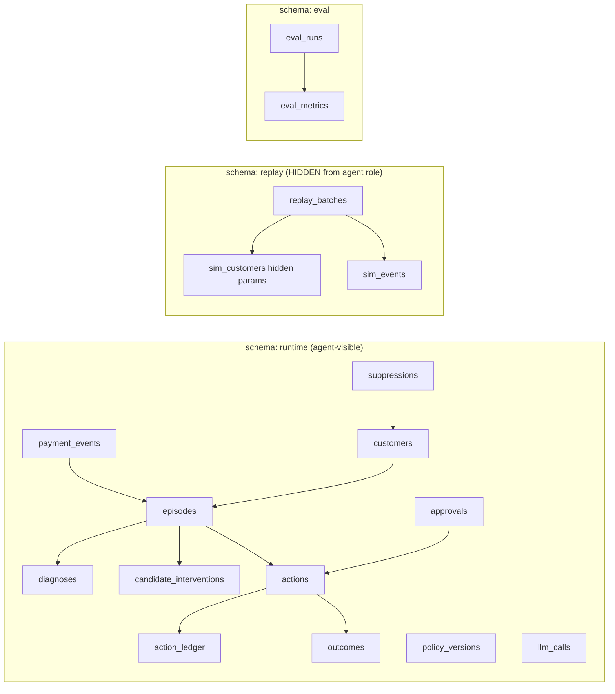
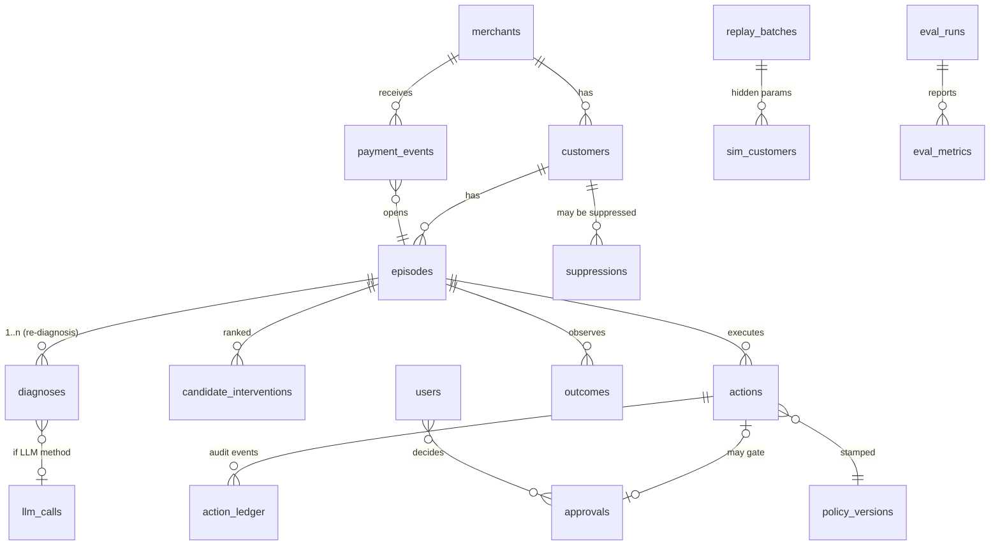

# Schema — Reflex Data Model

**Version:** 1.0 · Postgres 16 · Three schemas enforce ADR-004 separation: `runtime` (agent world), `replay` (hidden simulator truth), `eval` (evidence). **Agent services connect with a DB role that cannot read `replay` tables containing hidden parameters.**

All money in **paise (BIGINT)**. All timestamps `TIMESTAMPTZ` (IST-displayed).

---

## 1. Data Architecture

## 2. Entity Relationship Diagram

## 3. Tables

### runtime.users
| Column | Type | Null | Default | Notes |
|---|---|---|---|---|
| id | UUID | no | gen_random_uuid() | PK |
| email | TEXT | no | | UNIQUE |
| role | enum.role | no | | viewer/operator/approver/admin |
| created_at | TIMESTAMPTZ | no | now() | |

### runtime.merchants
| Column | Type | Null | Default | Notes |
|---|---|---|---|---|
| id | UUID | no | | PK |
| name | TEXT | no | | "SipDaily" |
| cfg | JSONB | no | | caps:4, contacts/day:2, quiet_hours:"21:00-09:00", budget_paise_daily:500000, approval_threshold_paise:5000000 |
| mode | enum.mode | no | advisory | advisory/autonomous/degraded/halted |
| created_at | TIMESTAMPTZ | no | now() | |

### runtime.customers
| Column | Type | Null | Default | Notes |
|---|---|---|---|---|
| id | UUID | no | | PK |
| merchant_id | UUID | no | | FK merchants |
| pseudonym | TEXT | no | | "C-4821" — **no real PII stored** |
| vpa_masked | TEXT | yes | | "a***@ybl" |
| lang_pref | TEXT | no | 'hinglish' | hinglish/en |
| ltv_band | enum.ltv_band | no | mid | low/mid/high — feeds annoyance penalty |
| dnd_flag | BOOLEAN | no | false | pre-seeded DND |
| created_at | TIMESTAMPTZ | no | now() | |

Indexes: `(merchant_id)`.

### runtime.payment_events
| Column | Type | Null | Default | Notes |
|---|---|---|---|---|
| id | UUID | no | | PK |
| provider_event_id | TEXT | no | | **UNIQUE** — webhook dedup key |
| episode_id | UUID | yes | | FK episodes (null until episode created) |
| source | enum.source | no | | live_tm / replay |
| rail | enum.rail | no | | card/uppi/netbanking/wallet/nach_emandate |
| code_raw | TEXT | no | | raw decline string (untrusted — injection-tagged downstream) |
| amount_paise | BIGINT | no | | CHECK (> 0) |
| occurred_at | TIMESTAMPTZ | no | | |
| raw_payload | JSONB | no | | redacted copy (PII scrubbed pre-store) |
| ingested_at | TIMESTAMPTZ | no | now() | |

Indexes: UNIQUE `(provider_event_id)`; `(episode_id)`; `(source)`.

### runtime.episodes
| Column | Type | Null | Default | Notes |
|---|---|---|---|---|
| id | UUID | no | | PK |
| customer_id | UUID | no | | FK |
| merchant_id | UUID | no | | FK |
| payment_event_id | UUID | no | | FK — opening event |
| amount_paise | BIGINT | no | | |
| status | enum.episode_status | no | waiting_diagnosis | state machine AppFlow §14 |
| arm | enum.arm | no | reflex | reflex/b0/b1 (eval runs) |
| actions_used | SMALLINT | no | 0 | CHECK (0..4) |
| opened_at | TIMESTAMPTZ | no | | |
| closes_at | TIMESTAMPTZ | no | | opened + 72h sim |

Indexes: `(status)`, `(arm, status)`, `(customer_id)`.

### runtime.diagnoses
| Column | Type | Null | Default | Notes |
|---|---|---|---|---|
| id | UUID | no | | PK |
| episode_id | UUID | no | | FK |
| canonical_code | enum.canonical_code | no | | taxonomy below |
| confidence | NUMERIC(3,2) | no | | 0–1 |
| method | enum.dx_method | no | | rule/llm |
| rationale | TEXT | no | | ≤ 240 chars |
| llm_call_id | UUID | yes | | FK llm_calls |
| created_at | TIMESTAMPTZ | no | now() | |

### runtime.candidate_interventions
| Column | Type | Null | Default | Notes |
|---|---|---|---|---|
| id | UUID | no | | PK |
| episode_id | UUID | no | | FK |
| intervention | enum.intervention | no | | see enums |
| p_recover | NUMERIC(6,4) | no | | propensity |
| expected_gain_paise | BIGINT | no | | p × amount |
| cost_paise | BIGINT | no | | channel cost |
| annoyance_paise | BIGINT | no | | penalty term |
| ev_paise | BIGINT | no | | gain − cost − annoyance |
| policy_version | TEXT | no | | "v2" |
| ranked_at | TIMESTAMPTZ | no | now() | |

Index: `(episode_id, ev_paise DESC)`.

### runtime.actions
| Column | Type | Null | Default | Notes |
|---|---|---|---|---|
| id | UUID | no | | PK |
| episode_id | UUID | no | | FK |
| intervention | enum.intervention | no | | |
| status | enum.action_status | no | proposed | machine §14 |
| **idempotency_key** | TEXT | no | | **UNIQUE** — `act:{episode}:{seq}` |
| channel | enum.channel | yes | | wa_sim/sms_sim/email_sim/voice_sim/razorpay_tm/null(wait) |
| cost_paise | BIGINT | no | 0 | |
| mode | enum.mode | no | | NORMAL/DEGRADED stamped |
| policy_version | TEXT | no | | |
| guardrail_snapshot | JSONB | no | | caps/budget/quiet/suppression state at dispatch |
| scheduled_for | TIMESTAMPTZ | yes | | |
| dispatched_at | TIMESTAMPTZ | yes | | |
| message_final | TEXT | yes | | post-injection text (logged) |
| created_at / updated_at | TIMESTAMPTZ | no | now() | |

Indexes: UNIQUE `(idempotency_key)`; `(episode_id)`; `(status)`.

### runtime.action_ledger  *(append-only; hash-chained)*
| Column | Type | Null | Default | Notes |
|---|---|---|---|---|
| seq | BIGSERIAL | no | | PK — global order |
| episode_id | UUID | no | | FK |
| action_id | UUID | yes | | FK |
| event | JSONB | no | | {type, actor, reason, ev?, guard?, mode} |
| prev_hash | TEXT | no | | |
| hash | TEXT | no | | sha256(seq ‖ prev_hash ‖ canonical(event)) |
| created_at | TIMESTAMPTZ | no | now() | |

**No UPDATE/DELETE grants to app role** (enforced); verification walks chain.

### runtime.outcomes
| Column | Type | Null | Default | Notes |
|---|---|---|---|---|
| id | UUID | no | | PK |
| episode_id | UUID | no | | FK |
| action_id | UUID | yes | | attribution (null = organic) |
| outcome | enum.outcome | no | | recovered/failed/expired |
| observed_at | TIMESTAMPTZ | no | | |
| latency_secs | INT | yes | | dispatch→recovery |

Index: `(episode_id)`; unique `(episode_id, outcome) where outcome='recovered'` (single recovery per episode).

### runtime.policy_versions
| id (semver TEXT PK) · params JSONB (incl. logistic coefficients) · trained_on_batch UUID null · notes TEXT · created_at |

### runtime.llm_calls
| id UUID PK · episode_id UUID FK null · purpose enum.llm_purpose (diagnosis/message/reply_classify) · prompt_hash TEXT · input_redacted JSONB · output_json JSONB · valid BOOL · latency_ms INT · cost_usd NUMERIC(10,6) · model TEXT · created_at |

### runtime.suppressions
| id UUID PK · customer_id UUID FK · reason enum.suppression_reason (complaint/optout/dnd/admin) · source TEXT · created_at | UNIQUE `(customer_id, reason)` |

### runtime.approvals
| id UUID PK · episode_id FK · action_id FK · requested_at · decided_at null · decided_by FK users null · decision enum.decision null · reason TEXT | Partial index on undecided.

### replay.replay_batches  *(eval evidence; batch metadata non-secret)*
| id UUID PK · seed INT · n_episodes INT · arm enum.arm · simulator_version TEXT · created_at |

### replay.sim_customers  *(HIDDEN — ground-truth behavioral params; agent DB role has NO SELECT)*
| id UUID PK · batch_id FK · runtime_customer_id UUID · p_respond_by_channel JSONB · salary_day INT · annoyance_threshold NUMERIC · intent TEXT (would_pay_if/wait_pay/never_pay) · params JSONB |

### replay.sim_events
| id UUID PK · batch_id FK · episode_id UUID · t_offset_secs INT · kind TEXT (reply/pay/nothing) · payload JSONB |

### eval.eval_runs
| id UUID PK · batch_id FK replay · arm enum.arm · ablation TEXT null (A1–A4/null) · config JSONB · preregistered_tag TEXT null | Refuse insert without protocol tag when running official protocol (app-level + docs).

### eval.eval_metrics
| id UUID PK · run_id FK · metric TEXT (recovery_rate, incremental_paise, cost_per_100p, complaint_rate, ttr_median, contacts_per_recovery, p95_latency, regret) · value NUMERIC · ci_low NUMERIC · ci_high NUMERIC |

## 4. Relationships

1 episode : n payment_events (re-fails) · 1 : n diagnoses · 1 : n candidates · 1 : ≤4 actions · 1 : n ledger events · 0..1 recovery outcome. Action : 0..1 approval. Customer : 0..n suppressions. Ledger chains globally by `seq`.

## 5. Enums

| Enum | Values |
|---|---|
| rail | `card, upi, netbanking, wallet, nach_emandate` |
| canonical_code | `INSUFFICIENT_FUNDS, ISSUER_DOWNTIME, EXPIRED_CARD, AUTH_DECLINED_SOFT, AUTH_DECLINED_HARD, RISK_HELD, MANDATE_REVOKED, MANDATE_LIMIT_BREACH, INVALID_VPA, CUSTOMER_INITIATED, UNKNOWN_AMBIGUOUS` |
| intervention | `RETRY_SAME_RAIL, RETRY_ALT_RAIL, PAYMENT_LINK_PUSH, UPI_LINK_PUSH, VOICE_CALL_SIM, MANDATE_REREG_SIM, WAIT, STOP_LOW_EV, ESCALATE_HUMAN` |
| channel | `wa_sim, sms_sim, email_sim, voice_sim, razorpay_tm, none` |
| episode_status | `waiting_diagnosis, diagnosed, waiting_approval, scheduled, acted, observing, recovered, expired, stopped_cap, stopped_low_ev, stopped_customer, stopped_approval_declined, escalated, halted` |
| action_status | `proposed, shield_pass, scheduled, dispatched, delivered_sim, observed, succeeded, failed, blocked, waiting_approval, cancelled_halt, superseded, parked` |
| outcome | `recovered, failed, expired` |
| role | `viewer, operator, approver, admin` |
| mode | `advisory, autonomous, degraded, halted` |
| arm | `reflex, b0, b1` |
| dx_method | `rule, llm` |
| source | `live_tm, replay` |
| suppression_reason | `complaint, optout, dnd, admin` |
| ltv_band | `low, mid, high` |
| decision | `approve, decline` |
| llm_purpose | `diagnosis, message, reply_classify` |

## 6. Audit Tables

`action_ledger` (above) is the audit spine. Additionally: `mode_changes` (from/to, actor, reason, at) · `guardrail_settings_history` (merchant cfg JSONB diffs) · security log stream (401s, blocked dispatches, tamper alerts) — file-based JSONL + `runtime.security_events` table.

## 7. AI Evaluation Tables

`llm_calls` (per-call evidence: input-redacted, output, validity, latency, cost) · `eval.eval_runs` / `eval.eval_metrics` (arm/ablation/CIs) · `runtime.policy_versions` (params + lineage) · prompt versions in `packages/prompts` (hash recorded in `llm_calls.prompt_hash`). AI-1 accuracy suite artifacts committed under `eval/results/dx_holdout/`.

## 8. Transaction / Financial Tables (safety columns)

- `actions.idempotency_key` UNIQUE — duplicate dispatch impossible at DB level.
- `actions.status` machine — no skip from `proposed`→`dispatched` without `shield_pass` (transition guard in code + trigger check).
- `actions.guardrail_snapshot` — what Shield saw, frozen.
- `approvals` — gate record (who/when/why; timeout auto-decline job).
- No money-movement tables exist in MVP: executors only create RP-TM orders/links; capture events come back as `payment_events` (source=live_tm) or simulator events (source=replay). Rollback concept = suppression + kill switch + parked actions (AppFlow §11); reversal of "sends" is N/A (messages only) — documented in `docs/safety.md`.

## 9. Row-Level Security / Access Control

- App roles: `reflex_agent` (runtime only), `reflex_eval` (runtime+replay+eval), `reflex_admin`. **`reflex_agent` lacks SELECT on `replay.sim_customers/sim_events`** — the anti-cheat boundary (ADR-004).
- Human RBAC at API layer (roles enum); audit screens require viewer+; approvals write requires approver.

## 10. Data Validation

DB CHECKs: amounts > 0 · confidence ∈ [0,1] · actions_used ∈ [0,4] · enum domains everywhere. App-layer Pydantic mirrors (single source in `packages/core/schemas.py`, generated to TS). Webhook raw body validated before parse; unknown fields preserved in `raw_payload` (never dropped silently).

## 11. Retention

Demo/repo data: permanent (it's evidence). Runtime logs 30d. `llm_calls.input_redacted` scrubbed at write. No deletion of ledger ever (append-only by grants).

## 12. Privacy

No real PII: customers are synthetic `[SIMULATED]`; VPAs masked at generation; PII scrubber on `raw_payload` storage; LLM inputs validated PII-free by test (`tests/security/test_no_pii_in_prompts.py`); exports carry `[SIMULATED]` headers.

## 13. Seed / Demo Data

`data/generators/`:
- **Customers:** 3,000 profiles — LTV bands, salary days (1–7 cluster), lang pref (70% hinglish), 3% DND — distributions cited in `calibration_sources.md`.
- **Failure events:** canonical-code mixture (INSUFFICIENT_FUNDS 34%, ISSUER_DOWNTIME 12%, AUTH_SOFT 14%, MANDATE_REVOKED 9%, EXPIRED_CARD 7%, AUTH_HARD 6%, MANDATE_LIMIT 5%, INVALID_VPA 3%, CUSTOMER_INITIATED 4%, ambiguous tail 6%) with messy issuer string variants (5–8 paraphrases per code) — the rules/LLM split target.
- **Hidden sim params:** per-customer `p_respond_by_channel`, annoyance thresholds, intents (`would_pay_if 55% / wait_pay 30% / never_pay 15%`) — calibrated so organic ≈7%, naive ≈24% (documented fitting notes; **actuals come from runs, targets never hard-coded into the agent**).
- **Demo slice:** fixed seed `demo-7` → exactly 214 episodes / ₹2,41,000 (one ₹48,000 B2B-style high-value invoice guaranteed for the approval moment; one pre-seeded complaint trajectory for injection 3).
- **Reply corpus:** 300 labeled replies incl. Hinglish complaints/promises/opt-outs + 40 injection attempts.

## 14. Migration Strategy

Alembic; baseline V1 creates schemas/tables/enums/grants; forward-only during buildathon; seed via `make seed` (idempotent); eval protocol tag protects result provenance (git, not DB).