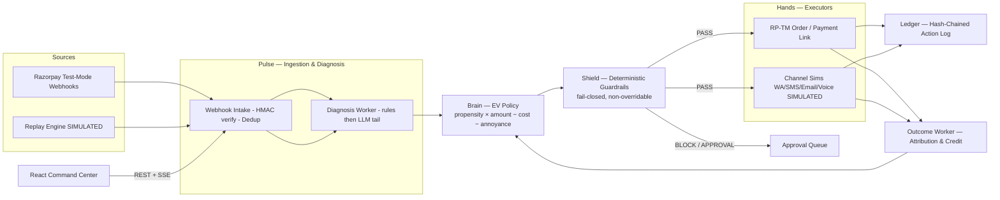

# Reflex — AI Revenue Recovery Agent


> Recover more, annoy less, prove everything. A bounded, root-cause-diagnosing payment-recovery agent built for the **Razorpay AI Buildathon — Track 03 (AI Revenue Recovery)**.

<!-- Badges Row -->
[](#)
[](https://www.python.org/)
[](https://fastapi.tiangolo.com/)
[](https://react.dev/)
[](https://www.postgresql.org/)
[](LICENSE)
[](#evaluation--pre-registered-metrics)

**[Live Demo Video](#)** · **[Contributing Guide](CONTRIBUTING.md)** · **[Operator Runbook](MANUAL_STEPS.md)**

---

## Table of Contents
- [The Problem: Why Subscriptions Leak Revenue](#the-problem-why-subscriptions-leak-revenue)
- [How Reflex Solves It (AI vs. Deterministic)](#how-reflex-solves-it-ai-vs-deterministic)
- [System Architecture](#system-architecture)
- [Key Features](#key-features)
- [Getting Started (5-Minute Setup)](#getting-started-5-minute-setup)
- [Running the Demo & Failure Injections](#running-the-demo--failure-injections)
- [Evaluation & Pre-Registered Metrics](#evaluation--pre-registered-metrics)
- [What Broke & How We Fixed It (Hackathon Post-Mortem)](#what-broke--how-we-fixed-it-hackathon-post-mortem)
- [Project Structure](#project-structure)
- [License](#license)

---

## The Problem: Why Subscriptions Leak Revenue

Indian subscription/D2C merchants lose recurring revenue every month to failed UPI AutoPay debits, card declines, and e-mandate/NACH failures — and today they respond with either **silence** (revenue quietly leaks) or **dumb blast SMS** (revenue leaks *plus* annoyed customers). Recovery is manual, root-cause-blind, unmeasured, and often customer-hostile — even though recovered revenue is **~100% margin**, the cheapest money a merchant can acquire.

## How Reflex Solves It (AI vs. Deterministic)

The governing principle: ***AI proposes, deterministic code disposes.***

**Where AI (LLM) is used — judgment only, on the ambiguous tail (~25–30%):**
- **Diagnosing messy bank decline strings** that a lookup table can't cover (the same root cause surfaces as different issuer strings across banks).
- **Hinglish message phrasing** around slot skeletons (empathy + genuine vernacular at scale).
- **Reply classification** (PROMISE / REFUSE / COMPLAINT / OPTOUT) on free-text replies.

**Where deterministic code rules — always:**
- EV arithmetic (`p_recover × amount − channel_cost − annoyance_penalty`), caps, budgets, quiet hours, scheduling math.
- The **Shield**: a separate guardrail module the policy can only *propose* to — never bypass.
- Idempotent dispatch, ledger writes, compliance filtering.
- **The LLM never authors an amount, link, deadline, or UPI handle.** Numbers are DB-injected after generation; a validator rejects any digit/URL/₹ span in LLM text (100% rejection corpus, CI-enforced).

## System Architecture



Six subsystems, one deployable: **Pulse** ingests and diagnoses · **Brain** scores interventions by expected value · **Shield** deterministically permits or blocks · **Hands** execute via Razorpay test-mode APIs and simulated channels · **Ledger** hash-chains every decision · **Proof** runs the pre-registered evaluation.

## Key Features

- **Root-Cause Diagnosis** — Rules-first (unit gate ≥70%; rules coverage 89.6% on the 500-case degraded holdout — `eval/results/dx_holdout/report.json`), LLM tail for messy issuer strings, confidence-gated with safe defaults.
- **Expected Value (EV) Policy** — Every intervention scored: `EV = p_recover × amount − cost − annoyance`; all four terms persisted per candidate; negative EV ⇒ STOP shown with the math.
- **Shield Guardrails** — Deterministic, fail-closed, non-overridable: 4 actions/episode · 2 contacts/customer/day · ₹5,000/day budget · quiet hours 21:00–09:00 IST · suppression/DND list · value > ₹50,000 ⇒ human approval · kill switch (**drain measured: 25 ms for 500 scheduled actions**).
- **Simulation Honesty Architecture** — Pre-registered protocol (git-tagged before any results), tuned (never strawman) baseline, a published losing cohort, and structural anti-cheat: the agent DB role **physically cannot read simulator ground truth** (ADR-004, verified by SQLSTATE-42501 tests).
- **Degraded Mode** — Two consecutive LLM failures flip a global degraded flag: rules-only diagnosis + frozen policy, zero dropped episodes, every action stamped `DEGRADED`. The system is LLM-absent-safe by design.
- **Hash-Chained Audit Ledger** — Append-only `sha256(seq ‖ prev_hash ‖ canonical(event))` chain with tamper-detection endpoint; no UPDATE/DELETE grants to the app role.
- **Complaint Safety** — Keyword rule-gate runs first regardless of model health; COMPLAINT ⇒ instant global suppression + human handoff. Gates: COMPLAIN precision ≥95% **and recall ≥90%** (both green offline).

## Getting Started (5-Minute Setup)

```bash
# 1. Clone the repository
git clone https://github.com/abhinav-phi/reflex.git
cd reflex

# 2. Configure environment variables
cp .env.example .env
# (Add optional LLM_API_KEY here; system runs LLM-absent-safe without it)

# 3. Boot infrastructure, apply migrations, and seed data
make up        # docker compose: postgres+redis+api+workers+web, then migrations
make seed      # idempotent: 4 users, merchant "SipDaily", policy v1, corpora

# 4. Start the demo slice (214 episodes / ₹2,41,000 failed value, seed demo-7, ×100)
make demo
```

> **Endpoints:**
> - Full-Docker route: UI on **http://localhost:8080**, API on **http://localhost:8000** (`make demo` targets `:8899` by default — set `REFLEX_API=http://localhost:8000` when using the full Docker stack).
> - Local dev route: Vite on **http://localhost:5173**, API on **:8899** (`8000` is OS-reserved on some Windows hosts). Full walkthrough: [MANUAL_STEPS.md](MANUAL_STEPS.md).
>
> Postgres is published on host port **15432** by default (Windows reserves port ranges that cover 5432 — see [Troubleshooting](#what-broke--how-we-fixed-it-hackathon-post-mortem) and [MANUAL_STEPS.md §10](MANUAL_STEPS.md#10-troubleshooting-engine)).

Seeded logins (password `reflex-demo`): `admin@reflex.dev` · `approver@reflex.dev` · `operator@reflex.dev` · `viewer@reflex.dev`.

## Running the Demo & Failure Injections

The demo replays a deterministic slice — **214 episodes / ₹2,41,000 failed value** (seed `demo-7`, ×100 speed) including one ₹48,000 corporate order and one pre-seeded complaint trajectory. Honesty note: ₹48,000 is UNDER the default ₹50,000 strict-greater approval threshold, so the invoice does not enter `/approvals` on its own — the human-approval path is demonstrated via a control-inject/manual API scenario. The naive-baseline twin runs on the same batch so counters compare arms live.

Three failures are injected through the **real system path** — never scripted fakery:

| Injection | Where | What you see |
|---|---|---|
| `llm_outage` | `/ops` → Inject LLM Outage | Amber DEGRADED banner; stream continues; actions stamped `DEGRADED`; zero drops |
| `webhook_storm` | `/ops` → Inject Webhook Storm | 1,000 events ingested → **214 episodes** (786 duplicates collapsed), dedup counters |
| `complaint` | `/ops` → Inject Complaint | Instant suppression + human-handoff approval item + episode STOPPED_CUSTOMER |

Kill switch: one click from the dashboard control bar (or `POST /api/control/mode {"mode":"halted"}`). Measured drain: ≤1 s budget, 25 ms actual.

## Evaluation & Pre-Registered Metrics

The protocol was committed and git-tagged **`eval-preregistered-v1` before any results existed** — provable from history. One command reproduces everything: `./eval/reproduce.sh`.

**Design targets** (pre-registered — actuals only ever come from runs):

| Arm | Recovery rate | Cost / ₹100 recovered | Complaint rate |
|---|---|---|---|
| B0 — do nothing | ~7% | ₹0 | ~0% |
| B1 — tuned naive (retry×3 + blast SMS×2) | ~24% | ~₹6.9 | ~1.9% |
| **Reflex** | **~42%** | **~₹3.0** | **<0.5%** |

Plus ablations A1–A4 (which AI component buys which points), bootstrap 95% CIs, and one honestly-reported losing cohort (<₹150 ephemeral failures where contact cost > EV — Reflex correctly declines). The table above stays as the *aspiration*; actuals are below and they came in under it — reported honestly.

> ### ✅ Official Run — EXECUTED (all values [SIMULATED])
> The pre-registered official evaluation **executed on 2026-08-24** under tag `eval-preregistered-v1` — N=3000 × seeds {42, 1337, 2025} × 8 arms — with artifacts committed at **[`eval/results/20260826T105147Z/`](eval/results/20260826T105147Z/results.json)** (`results.json` + `tables.md`). Headline actuals [SIMULATED]: **Reflex 31.27%** recovery CI[28.94, 33.98] · cost ₹0.27/₹100 recovered · complaints 0.256% — vs tuned-naive B1 **21.22%** CI[19.10, 23.36] · ₹0.15 · 0.478% and do-nothing B0 **4.68%** CI[3.71, 5.75]. **Incremental vs B1: +10.05 pp** CI[+7.83, +12.62].
>
> Honesty first, as always: the pre-registered **G1 gate (incremental ≥ +15 pp) was NOT met** (+10.05 < +15 — Reflex beats tuned-naive decisively, the CI excludes 0, but by less than the aspirational target); G2 cost and G3 complaint gates pass. This run also executed **without an `LLM_API_KEY`**, so the reflex arm is the rules-first path end-to-end (degraded == full; the LLM-tail value is unmeasured until a keyed rerun), and ablation A2 (EV off) scored *higher* than full mode — committed verbatim, never tuned away. Full gate scorecard and caveats: [docs/limitations.md](docs/limitations.md). That's the brand: it never lies about what it did.

## What Broke & How We Fixed It (Hackathon Post-Mortem)

Real answers to "what broke, and how did you get out":

1. **Docker Desktop crashed during parallel eval runs.** Root-caused in two layers: Postgres connection exhaustion during parallel arms (fixed: `-c max_connections=300`, right-sized pools) and cross-arm suppression-write deadlocks (fixed: one global advisory lock + savepoint isolation). Later we found the deeper host issue — see #5.
2. **Async webhook body parsing bug.** FastAPI consumed the body before HMAC verification could read raw bytes (fixed: read raw body first, stash on scope, verify signature *before* parse).
3. **Worker `_mode` NameError crashed the loop post-smoke.** Fixed; caught because sim-time clocks differ between Proof and runtime paths.
4. **Latent `ctx` NameError on the live dispatch path** — eval arms pass context explicitly, so tests stayed green while the live worker path would have crashed. Found by lint during a documentation audit sync; fixed and covered by a halted-flag regression test. *"It compiles" ≠ "it works."*
5. **The eval-blocking "host Docker instability," fully diagnosed:** Windows excluded-port ranges (`netsh interface ipv4 show excludedportrange protocol=tcp`) reserved ports 5276–5875 — which covers **5432**, so Postgres could never bind. Workaround documented in the runbook; environmental, not product code.
6. **Kill-switch "≤1 s drain" was a claim without a number.** We wrote a measurement harness against the real DB path: **25 ms for 500 scheduled actions**. Now it's evidence, not marketing.

## Project Structure

```text
reflex/
├── apps/
│   ├── api/          # FastAPI: ingestion, REST, SSE, control plane (Pulse)
│   ├── workers/      # diagnosis / decision / outcome consumers
│   ├── eval/         # Proof: replay engine, generator, baselines, runner
│   └── web/          # React command center (Vite + TS strict + Tailwind)
├── packages/
│   ├── core/         # domain models, enums, state machines, PII/money utils
│   ├── shield/       # guardrails — import-isolated, zero LLM/network deps
│   ├── brain/        # EV policy, propensity model, trainer
│   ├── connectors/   # RP-TM client (test mode), channel simulators
│   ├── ledger/       # hash chain append/verify
│   └── prompts/      # versioned prompt templates + output validators
├── data/             # generators, calibration sources, corpora, seeds
├── eval/             # PROTOCOL.md (pre-registered), reproduce.sh, results/
├── tests/            # unit/integration/api/security/load/e2e
├── docs/             # internal design documentation (maintainers-only, not published)
└── docker-compose.yml
```

## License

Apache License 2.0 — see [LICENSE](LICENSE).
