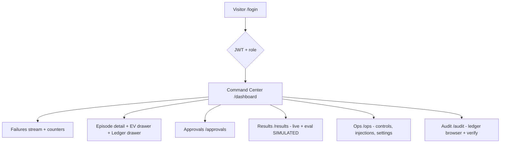
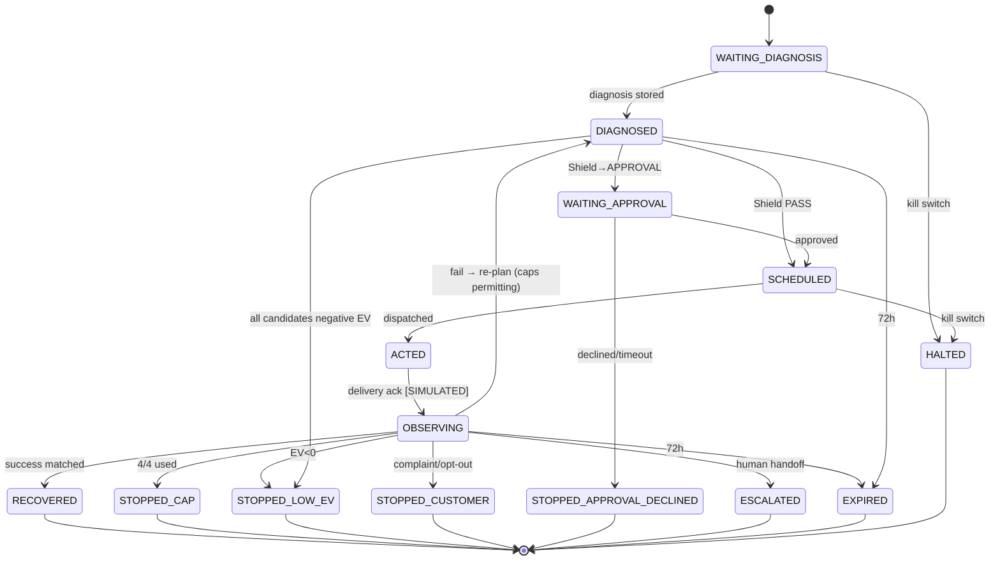

# AppFlow — Reflex

**Version:** 1.3 · Terminology per `1. PRD.md` / `2. TechSpec.md`.

> **v1.1 SYNC NOTE:** §16 adds a flow-by-flow verification matrix. Sections 1–15 remain the
> designed flows; where only the in-process pipeline (shared code with workers) has been
> exercised, that is stated explicitly. **No live browser/HTTP/worker session has been
> demonstrated yet** — dashboard/SSE/injection flows are IMPLEMENTED — UNVERIFIED.

---

## 1. Global Application Flow



## 2. Onboarding Flow (demo merchant, ~5 min)

1. Admin signs in → `/onboarding` (only when no merchant configured).
2. Enter test-mode Razorpay keypair `[TEST MODE badge]` → connectivity check (create+cancel a ₹1 test order).
3. Webhook URL + secret generated → shown with copy button + HMAC test ping.
4. Import customer context → uses seeded **SipDaily** dataset `[SIMULATED badge]`.
5. Guardrail defaults presented (caps 4/2, quiet hours 21:00–09:00 IST, budget ₹5,000/day, approval threshold ₹50,000) → editable → saved ledgered.
6. Choose starting mode (**Advisory** recommended) → `/dashboard`.

## 3. Authentication Flow

- `/login` → POST `/api/auth/login` (seeded users: `admin@reflex.dev`, `approver@…`, `operator@…`, `viewer@…`) → JWT (8h) → role gates UI **and** server.
- 401 on expiry → redirect `/login?expired=1`.
- RBAC matrix enforced server-side (TechSpec §10); UI hiding is cosmetic only.

## 4. Main Dashboard Flow (`/dashboard`)

1. **Control bar** (sticky): mode badge (Autonomous/Advisory/**Degraded**/Halted) · kill switch · demo controls · time-acceleration indicator (×1/×25/×100).
2. **Counters row:** Failed today ₹ · Recovered (Reflex) ₹ · Recovered (naive baseline, same batch) ₹ · Complaint rate · Cost per ₹100.
3. **Failures stream** (live): each row = episode card w/ diagnosis chip, amount, rail, age, action status.
4. Click row → **Episode drawer**: diagnosis (code, confidence, method RULE/LLM, rationale) → candidate list with EV breakdowns → action timeline → outcome.
5. Any action chip → **EV drawer**: `EV +₹412 = p 0.34 × ₹1,299 − cost ₹0.8 − annoyance ₹22 · cap 2/4 · quiet-hours clear · policy v2 · Shield PASS`.
6. Ledger icon → **Ledger drawer**: hash-chained events, `mode` stamps, blocked-action entries.

## 5. Primary User Workflow — Episode lifecycle (detailed)

**Scenario:** SipDaily customer's ₹299 UPI AutoPay debit fails (`Sim:insufficient balance — try later`, 28th of month, 09:14).

1. **Ingest (t+0s):** webhook received → HMAC verified → dedup check (Redis SETNX `evt:<provider_id>`) → `payment_events` insert → episode `EPS-1042` created (`WAITING_DIAGNOSIS`), ledger entry #1.
2. **Diagnose (t+0.1s):** rules engine matches fuzzy "insufficient balance" pattern → `INSUFFICIENT_FUNDS`, confidence 0.97, method RULE. (If rules missed: LLM tail per TechSpec §7 AI-1; confidence < 0.6 ⇒ UNKNOWN_AMBIGUOUS ⇒ conservative `WAIT` action (`scheduled_for` ≈ +4h).) Ledger #2.
3. **Plan (t+0.3s):** Brain enumerates candidates for INSUFFICIENT_FUNDS using real `intervention` enum values *(v1.2 audit fix P2-2 — timing is the `scheduled_for` field, not part of the name)*: `WAIT` (deferred re-attempt; scheduler targets 16:00 IST salary-cycle window → p=0.34, EV +₹98), `UPI_LINK_PUSH` via wa_sim (p=0.29, EV +₹81), `RETRY_SAME_RAIL` now (new RP-TM order on upi; p=0.12, EV −₹180 after annoyance), plus a persisted `STOP_LOW_EV` bookkeeping candidate (EV 0 by definition). All candidates persisted with full four-term EV breakdown. Ledger #3.
4. **Guard (t+0.4s):** Shield sequence: kill-switch? off → mode? autonomous → non-contact actions (`STOP_LOW_EV`/`WAIT`) early-pass before cap checks → episode cap 0/4 ✓ → customer contacts today 0/2 ✓ → quiet hours? 09:14 ok, but scheduled 16:00 ok ✓ → budget ₹0.80 < ₹5,000 ✓ → suppressed? no → DND check? clear → value ₹299 < ₹50,000 ✓ ⇒ **PASS**. (Any fail ⇒ BLOCKED(reason) ledgered; approval triggers ⇒ queue.) Ledger #4.
5. **Schedule & dispatch (16:00 sim):** action `SCHEDULED` → `DISPATCHED` via Hands: RP-TM Payment Link created (idempotency key `act:1042:1`) + WhatsApp sim push `[SIMULATED]`. Message built: skeleton → LLM phrasing (no digits) → DB-injects ₹299, link, due date → validator PASS. Ledger #5 (pre/post-injection text).
6. **Observe (window 6h):** outcome worker polls simulator/customer events → customer pays via link at 17:22 sim → `payment.captured` matched → `outcomes: RECOVERED, attributed action 1, latency 1h22m`. Ledger #6.
7. **Attribution & learn:** episode → `RECOVERED` terminal; credit assignment updates propensity counters; batch trigger for policy v2 retrain (if enabled). Counters update via SSE. Ledger #7.
8. **Non-happy branches:** customer replies "baadme karta hoon" → AI-4 PROMISE(+date) → reschedule, cap+1 · customer replies angrily → COMPLAINT ⇒ suppress + `STOPPED_CUSTOMER` + approval-queue handoff · 72h elapse ⇒ `EXPIRED` · all caps used ⇒ `STOPPED_CAP` · EV<0 at planning ⇒ `STOPPED_LOW_EV` (shown with the math).

## 6. AI Workflow (canonical diagram)

```text
Failure event
   ↓ (deterministic) normalize + dedup
Rules diagnosis ──hit──► canonical code (conf 1.0)
   │miss
   ↓
LLM diagnosis (<data>-wrapped, no PII)
   ↓ schema-validate → retry once → else UNKNOWN_AMBIGUOUS
   ↓
EV policy: propensity × amount − cost − annoyance   [AI-2]
   ↓ rank candidates (all persisted)
   ↓
Shield deterministic checks (FAIL-CLOSED)
   ↓ PASS / BLOCK / APPROVAL-GATE
   ↓
Message: skeleton → LLM phrasing (no digits) → DB slot-injection → validator
   ↓ PASS (else template fallback)
Executor (idempotent, allowlisted tools)  [SIMULATED channels]
   ↓
Outcome window → attribution → credit assignment
   ↓
Hash-chained ledger append (every step above already appended)
   ↓
Dashboard counters / EV drawer / audit trail
```

## 7. Success Flow (system-level definition)

Episode reaches **RECOVERED** via ≤ 4 actions, ≤ budget, zero guardrail violations, full ledger, attribution recorded, counters updated. Global success: three-arm eval executed; Reflex > B1 with CI excluding zero; complaint rate < 0.5%.

## 8. Failure Flow (three demoable injections + internals)

**Injection 1 — LLM outage (`/api/control/inject/llm_outage`):**
1. LLM health flips failing → detection after 2 consecutive failures (≤ 5 s).
2. Global banner **"DEGRADED MODE — deterministic fallback policy active"**; control bar turns amber.
3. New episodes: rules-only diagnosis; UNKNOWN tail ⇒ conservative default (wait → single free-channel nudge at optimal hour).
4. In-flight LLM calls abort → same fallback. **Zero episodes dropped.**
5. Every action stamped `mode=DEGRADED`; recovery rate visibly dips (~9 pts) *[ASSUMPTION — design expectation; the only executed measurement shows DEGRADED ≡ full at 33.83% because the honest LLM matched the conservative fallback on the synthetic tail]* but continues.
6. Restore → banner clears; stamped actions remain as evidence.

**Injection 2 — Webhook storm (`webhook_storm`):** 1,000 replays of 214 real events → dashboard shows "1,000 events ingested → 214 episodes (786 duplicates collapsed)" in < 10 s; zero duplicate actions; ledger shows dedup counters.

**Injection 3 — Complaint mid-episode (`complaint`):** active episode's next simulated reply is a complaint → AI-4 + keyword gate → instant global suppression → episode `STOPPED_CUSTOMER` → approval-queue item "Human handoff: complaint from customer #4821" → merchant resolves → suppression persists (only admin lifts) → zero further contacts guaranteed (tested).

**Internal failures F3–F8** (RP-TM timeout, budget exhaustion, worker crash, DB loss): per TechSpec §13; at least F3 shown in `/ops` during QA recording.

## 9. Edge Cases

| Case | Behavior |
|---|---|
| Same payment fails twice (genuine re-fail after recovery) | New episode; contact caps reset daily, annoyance factor carries history |
| Amount ₹0 or negative | Reject at ingestion (validation), security log |
| Unknown rail | Episode created, diagnosis UNKNOWN, conservative default |
| Two actions scheduled, first recovers | Second auto-cancelled (`SUPERSEDED`), ledgered |
| Approval pending when episode expires | Auto-close `EXPIRED`; approval auto-expired (fail-closed) |
| Customer marked DND pre-seeded | Shield blocks all outbound; only in-app/none |
| Kill switch during in-flight dispatch | Dispatch worker re-checks flag before send; drained within 1 s |
| Replay + live test-mode events simultaneously | Source-tagged; eval only counts replay arm batches |
| Ledger write fails | Action NOT dispatched (ledger-first invariant) |
| Simulated customer "pays" twice | Idempotent capture match; second ignored + logged |

## 10. Human Approval Flow (explicit gate design)

1. Triggers: episode value > **₹50,000** · pause/cancel-class intervention · complaint-flagged handoff · operator-configured extra rule.
2. Action created in `WAITING_APPROVAL`; episode state `WAITING_APPROVAL`; countdown (4h sim default) displayed.
3. Approver queue (`/approvals`): full context card — diagnosis, EV math, guardrail snapshot, message preview, risk note, reversibility note ("Send only; no money moved by this action").
4. Approve → dispatch proceeds (Shield re-checks — state may have changed). Decline → branch closed, `STOPPED_APPROVAL_DECLINED`, alternative low-risk candidates re-ranked.
5. Timeout → **auto-decline** (fail-closed), ledgered with reason.
6. All decisions: who/when/why in `approvals` + ledger.

## 11. Recovery Flow (system-level)

- **Kill switch:** `POST /api/control/mode {halted}` (or button) → Redis flag → workers drain, scheduled actions cancelled (`CANCELLED_HALT`), banner red. Resume ⇒ re-plan fresh; nothing auto-replays blind. **Drain ≤ 1 s is now MEASURED [LOCAL RUN — no CI artifact] (v1.3): 25.5 ms for 500 scheduled actions through the real DB path** (`tests/load/test_kill_switch_drain.py`); the dispatcher additionally re-checks the halted flag before every send.
- **Degraded → normal:** health restores ⇒ banner clears; UNKNOWN-diagnosed episodes re-diagnosed once, then resume normal policy.
- **Parked actions (F3):** `/ops` shows `action_pending` list with retry buttons and auto-heal (cron re-attempt every 5 min sim).
- **Ledger dispute:** `/audit` chain verification; breakage ⇒ system halts itself (integrity > availability).

## 12. Admin / Operations Flow (`/ops`)

- Users & roles view · guardrail settings (caps/quiet hours/budget/threshold — all changes ledgered) · channel simulator console (watch `[SIMULATED]` deliveries & replies live) · injection controls · parked-action queue · eval runner status · ledger verify button · export (episode CSV, ledger JSON — all labeled `[SIMULATED]`).

## 13. Demo Flow — 5-minute Buildathon pitch (exact script)

> **v1.1 HONESTY ANNOTATION (post-run update 2026-08-24):** the official pre-registered run
> **completed — final artifact 2026-08-30** committed at `eval/results/20260830T105923Z/`.
> Demos/pitches must quote the **ACTUALS**, labeled `[SIMULATED]` — Reflex **33.83%** vs naive B1
> **25.06%** vs organic B0 **4.11%** (incremental **+8.77 pp**), complaints **0.2% vs 0.533%**
> ([SIMULATED]) — NOT the old design targets ("42% vs 24% vs 7%"). The ₹ narration figures below are
> derived from those actuals against the fixed ₹2,41,000 demo slice; never present any of them as
> live production results, and if a judge asks for evidence, show `results.json` + `tables.md`.

**Setup before start:** `make demo` running; demo slice **214 episodes / ₹2,41,000 failed value**, seed `demo-7`, speed ×100; naive-baseline arm running in parallel (same batch, visible as comparison counter); LLM healthy. *(Slice generation contract unit-verified; runtime start via `/api/replay/start` [UNVERIFIED].)*

| Time | Action on screen | Narration |
|---|---|---|
| 0:00–0:30 | Full-screen dashboard, red counter **"FAILED TODAY ₹2,41,000 · RECOVERED ₹0 · NAIVE WOULD GET ~₹51,000 [SIMULATED]"**; failure cards streaming | "This is SipDaily. ₹2.4 lakh of subscription revenue failed today — UPI, cards, mandates. Merchants answer with silence or spam. Both leak money." |
| 0:30–1:00 | Margin slide (3 numbers) | "Recovered rupees are ~100% margin. Global dunning tools are card+English-first. India's UPI and mandate failures needed root-cause thinking. So we built the operator, not another dashboard." |
| 1:00–2:30 | **Live:** toggle Reflex ON → chips appear (`INSUFFICIENT_FUNDS — salary-week`, `ISSUER_DOWNTIME`, `MANDATE_REVOKED`) → open EV drawer on ₹299 episode → show the approval queue via the `complaint` control-inject scenario (the ₹48,000 invoice sits just UNDER the ₹50,000 default approval line — see Tracker TASK-059) → green counter climbs toward **~₹75,700 [SIMULATED]** past naive's **~₹51,000** | "Every action shows its math and its guardrail state. High-value anything waits for a human. Watch recovery beat the naive baseline on the same batch." |
| ~2:10 | **Flip LLM-OUTAGE switch live** → amber banner → stream continues, actions stamped `DEGRADED` | "The LLM dies. Nothing stops — deterministic fallback, every action stamped. It never lies about what it did." |
| 2:30–3:30 | Architecture slide (TechSpec §2) + AI/not-AI table | "AI decides *what* and *when*. Deterministic code decides *whether it's allowed* and *how it costs*. The LLM never touches a number." |
| 3:30–4:15 | `/results` — three-arm table w/ CIs + ablation bars (`[SIMULATED]` badges visible) **[ACTUALS — quote the committed run `eval/results/20260830T105923Z/`, always labeled SIMULATED]** | "33.8% vs 25.1% vs 4.1% — incremental +8.8 points with committed CIs, cheaper per ₹100, fewer complaints (0.2% vs 0.533%). Ablations show which AI component buys which points. Pre-registered, one command, reproducible." |
| 4:15–4:45 | Failure table slide + `/audit` chain verify + `/approvals` | "Five failure modes, handled and logged. Caps, quiet hours, kill switch, human gates, hash-chained audit." |
| 4:45–5:00 | Razorpay frame slide | "Reflex raises effective payment success rate merchant-side, on public test-mode APIs. Pilot it with ten subscription merchants in a week. We'd love to build that." |

**60-second WOW (subset):** 0–10 red counter · 10–25 toggle on + chips · 25–40 EV drawer + approval approve · 40–50 counters pass baseline · 50–60 outage switch → still recovering.

## 14. State Machines

**Episode:**



**Action:** `PROPOSED → SHIELD_PASS → SCHEDULED → DISPATCHED → DELIVERED_SIM → OBSERVED → {SUCCEEDED | FAILED}` + side states `BLOCKED(reason)`, `WAITING_APPROVAL`, `CANCELLED_HALT`, `SUPERSEDED`, `PARKED`.

## 15. Route / Screen Map

```text
/
├── /login
├── /onboarding                 (admin, first run)
├── /dashboard                  (command center: stream, counters, drawers)
│   ├── episode drawer (overlay)
│   ├── EV drawer (overlay)
│   └── ledger drawer (overlay)
├── /approvals                  (approver)
├── /results                    (live + eval metrics [SIMULATED])
├── /audit                      (ledger browser + chain verify)
└── /ops                        (controls, injections, settings, sim console, users)
```

---

## 16. Flow Verification Matrix (v1.1)

Legend: **IP** = verified in-process (same code paths the workers execute, driven by Proof's
virtual clock + integration tests) · **LIVE** = verified over real HTTP/Redis/worker processes ·
**UNVERIFIED** = implemented, not yet exercised.

| § | Flow | Status | Evidence |
|---|---|---|---|
| §2 | Onboarding (keys→webhook→guardrails→mode) | UNVERIFIED LIVE | 5 API routes + UI page implemented; RP ₹1 connectivity check requires real rzp_test_ keys |
| §3 | Auth + RBAC | **IP+API VERIFIED** | login endpoint + server-side matrix test (401/403 per role×route) |
| §4 | Dashboard counters/stream/drawers | UNVERIFIED LIVE | built (tsc/build/vitest green); SSE round-trip never demonstrated |
| §5 steps 1–2 | Ingest → dedup → episode; rules dx | **IP VERIFIED** | webhook tests (sig-401, dup-200, zero-amount reject) + storm integration (1000→214, 0 dupes) [LOCAL RUN — no CI artifact]; LLM-tail path verified offline-degraded |
| §5 step 3 | Brain: candidates persisted w/ EV breakdown | **IP VERIFIED** | candidate rows inspected in DB during runs; STOPPED_LOW_EV logged with math |
| §5 step 4 | Shield fixed-order checks | **IP VERIFIED** | unit suite incl. exact-at-cap/budget, quiet edges (21:00:00 blocked / 09:00:00 clear), suppressed/DND/HALTED/approvals |
| §5 steps 5–7 | Schedule→dispatch→[SIM] delivery→outcome→attribution | **IP VERIFIED** | golden-path integration: 100% terminals, single-recovery index, organic vs action attribution, ledger-first ACTION_DISPATCHED ≥ dispatched actions |
| §5 branches | PROMISE reschedule · COMPLAINT suppress+handoff · EXPIRED · STOPPED_CAP · STOPPED_LOW_EV · approval timeout auto-decline | **IP VERIFIED** | all observed in eval runs (APPROVAL_TIMEOUT_DECLINED / CUSTOMER_SUPPRESSED / EPISODE_EXPIRED ledger events) |
| §8 inj-1 | LLM outage → DEGRADED | PARTIAL | DEGRADED arm completes in-process with stamps + zero drops; live flip via /api/control/inject/llm_outage untested |
| §8 inj-2 | Webhook storm 1,000→214 | PARTIAL | dedup logic integration-tested at ingest level [LOCAL RUN — no CI artifact]; live /inject/webhook_storm untested |
| §8 inj-3 | Complaint mid-episode | PARTIAL | stop_customer real path tested (suppression + human-handoff event); forced trajectory in demo slice; live inject untested |
| §10 | Approval gate | **IP VERIFIED** | HIGH_VALUE + PAUSE_CANCEL_CLASS routing; timeout ⇒ fail-closed decline observed |
| §11 | Kill switch drain ≤1s | **MEASURED (IP)** | v1.3: harness cancels 500 scheduled actions via the real DB drain path in 25.5 ms (`tests/load/test_kill_switch_drain.py`); dispatcher halted-flag pre-send cancel tested; live API-button timing pass still pending |
| §14 | State machines | **IP VERIFIED** | code SM + DB triggers aligned; documented edge extensions: organic recovery pre-diagnosis; STOPPED_CUSTOMER from any active state; scheduled→blocked at dispatch re-check |
| §15 | Routes/screens | UNVERIFIED LIVE | SPA routes built; no browser session run |
